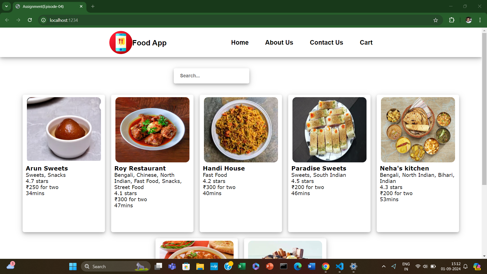

### NAMASTE REACT WEB SERIES EPISODE-04 (ASSIGNMENT) :

---

- Build a Food Ordering App :

   - Think of a cool name for your app.

   - Build a AppLayout.

   -  Build a Header Component with Logo & Nav Items & Cart.

   - Build a Body Component.

   -  Build RestaurantList Component.

   - Build RestaurantCard Component.

   - Use static data initially.

   - Make your card dynamic(pass in props).

   -  Props - passing arguments to a function - Use  Destructuring & Spread
   operator.

   - Render your cards with dynamic data of restaurants.

   - Use Array.map to render all the restaurants.

   ---

### Output :
   

   ---

[LIVE LINK](https://assignmentepisode4bykapil.netlify.app/)

