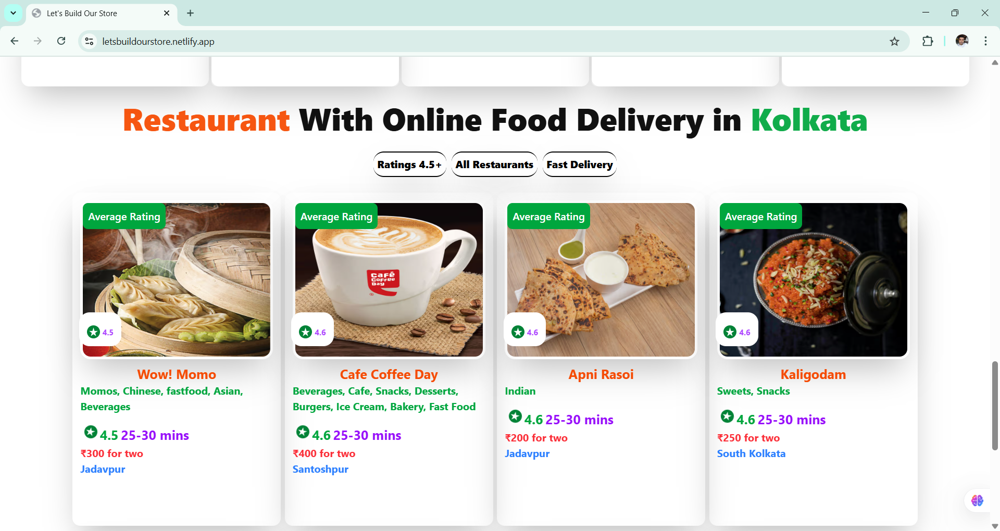

### EPISODE-12 (LET'S BUILD OUR STORE) :

### CODING ASSIGNMENT :

### Redux Toolkit

- Install @reduxjs/toolkit and react-redux

```
npm i @reduxjs/toolkit
```

```
npm i react-redux
```

- Build Our Store

- Connect our store to our App

- Create a Slice(cartSlice)

- dispatch(action)

- Read the data using Selector

[LIVE LINK](https://letsbuildourstore.netlify.app/)





