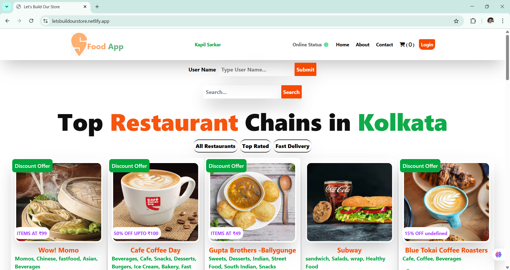
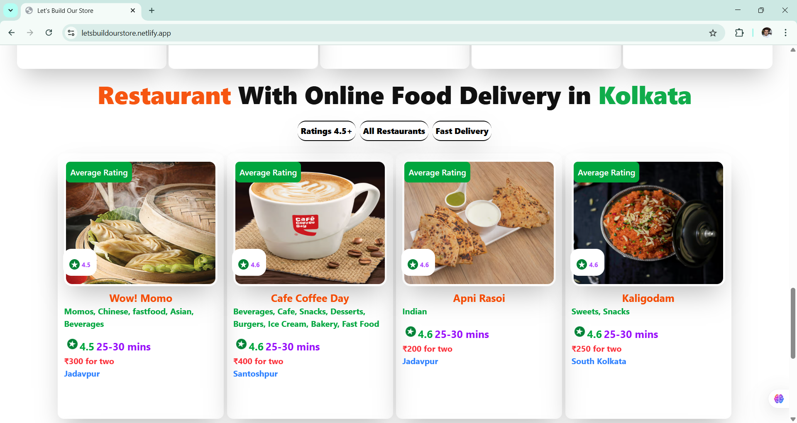
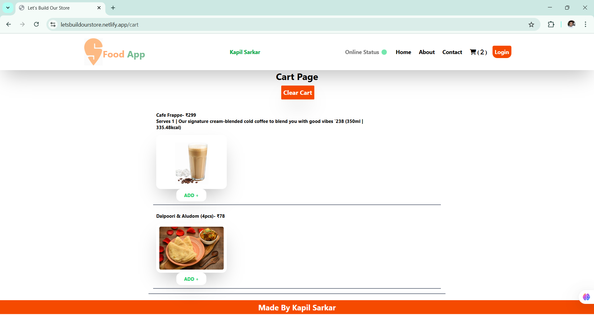
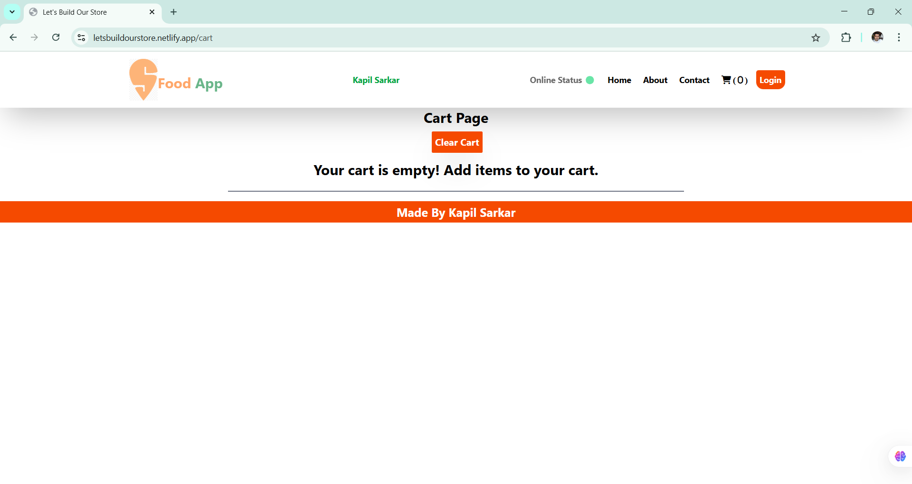

## 🍉 Food-App :

### Created a Food-App 🍉 🍉 from scratch using React and Tailwind CSS 🚀

[LIVE LINK](https://foodappkolkata.netlify.app/)

- Top Restaurant Chains in Kolkata using live api from Swiggy-WEbsite(Kolkata Location).
- Restaurants with Online Food Delivery in Kolkata using live api from Swiggy-WEbsite(Kolkata Location).!
- Food Delivery app home page with dynamic restaurant cards.
- Filter top rated restaurants.
- Filter restaurants with fast delivery time.
- Filter All Restaurants.
- Search Functionality.
- Clickable cards that will display restaurant menu.
- Dynamic Routing.
- Online/Offline status
- Dynamic Restaurant Menu
- Profile Section
- Custom Hooks
- React-redux and redux toolkit use (Add to cart and Clear Cart Option)
- Configured and Designed with Tailwind CSS
- Optimization using Lazy loading and suspense
- React testing library (jest)

### Instruction before running the project :

- If you are running it locally or from hosted link make sure you have installed Allow CORS chrome extension as it fetches the live data from swiggy's API.

### 💁‍♂️ Show your support :

- Give a ⭐️ if this project helped you and try to contribute and share with your developers.