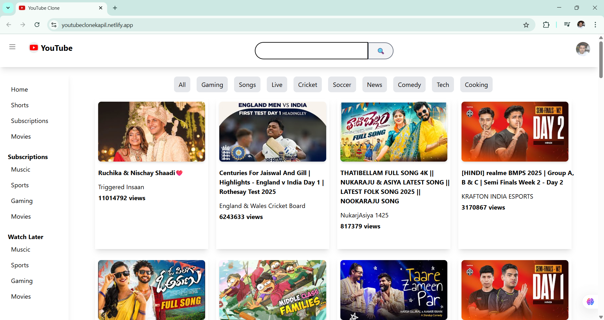
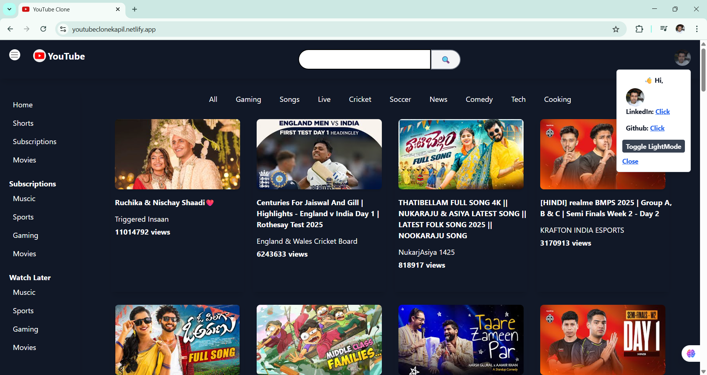
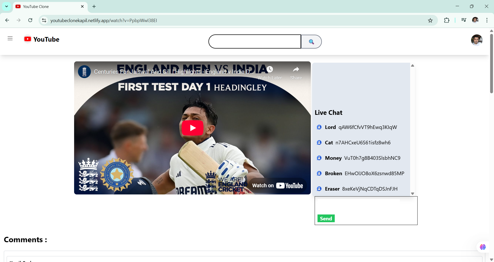

### YOUTUBE CLONE :

- This project is a YouTube clone built using React JS, React Router DOM, Redux, and various other libraries. It offers a rich user experience with features like responsive design, live chat, search functionality, sidebar toggling, debouncing for search, memoization/caching for optimizing API calls, and nested comments using recursion of components.

- Live Link : [Link](https://youtubeclonekapil.netlify.app/)

- Libraries and Technologies Used :

  - React: A JavaScript library for building user interfaces.
  - React Router DOM: For handling routing and navigation in the application.
  - Redux Toolkit: To manage the global state and store.
  - Tailwind CSS: For modular and responsive styling.
  - YouTube Data API: For fetching video content and suggestions.

- Key Features :

- YouTube API Integration:

   - The application seamlessly integrates with the YouTube API, allowing it to retrieve a wide range of video content directly from YouTube's vast library.

   - Through the power of the fetch method, the app dynamically fetches video details, including titles,  descriptions, thumbnails, and channel information, ensuring that users have access to the latest and most relevant videos. This real-time data integration keeps the content fresh and also provides users with a diverse selection of videos across various genres and interests.

- React Router DOM :

   - Utilizes React Router DOM for handling routing and navigation within the application. Allows seamless navigation between different views, such as the homepage, video playback, search results, and live chat.

- Redux State Management

  - Employs Redux Toolkit to efficiently manage global state and store data. Ensures data consistency and accessibility across different components.

  - SideBar toggling, Search Suggestions, Live Chat Data, Search suggestions caching functionaliity is achieved through Redux.

- Responsive Design

  - The application is designed to be responsive, providing an optimal viewing experience on various devices and screen sizes. It adapts to different screen resolutions and orientations.

- Live Chat

  - Implements a real-time chat functionality that enables users to interact with each other while watching live videos. Messages are displayed in a scrollable chat window and updated in real-time.

  - User can enter their own message and can see that in Live Chat Window.

- Search Functionality

   - Offers a robust search feature that allows users to search for videos by keywords.

   - Utilizes debouncing to optimize API calls and enhance user experience.

   - Provides auto-suggestions as users type in the search bar, enhancing usability using the Suggestions API.

- Sidebar Toggling

  - Features a sidebar that users can toggle on or off on click of HamBurger menu. The sidebar provides quick access to navigation links, such as Home, Shorts, Videos, and Live. Users can easily show or hide the sidebar based on their preferences.

- Memoization and Caching

  - Implements memoization and caching techniques thorugh Redux to optimize API calls and reduce redundant network requests. This improves application performance and speeds up content retrieval.

- Nested Comments

  - Implements nested comments using recursion of components. Users can view and interact with comments and replies in a threaded and organized manner. Replies to comments are visually nested under their parent comments for a clear discussion structure.

- Dark Mode Light Mode(Theme Toggling)

  - Using Redux Toolkit there is a theme toggling feature by clicking on the User Icon.


### How to Run Locally ;

1. Clone the repository from [LINK](https://github.com/kapilsarkar/NAMASTE--REACT/tree/main/YOUTUBE-CLONE).

```
git clone https://github.com/kapilsarkar/NAMASTE--REACT/tree/main/YOUTUBE-CLONE
```
2. Navigate to the project directory.
```
cd YOUTUBE-CLONE
```

3. Install the dependencies.

```
npm install
```

4. Create a .env file in the project root and add your YouTube Data API key 

```
REACT_APP_YOUTUBE_API_KEY = your - youtube - api - key;
```

5. Start the development server.

```
npm run dev
```

6. Open your browser and visit http://localhost:3000 to view the app.

### SCREENSHOT :



